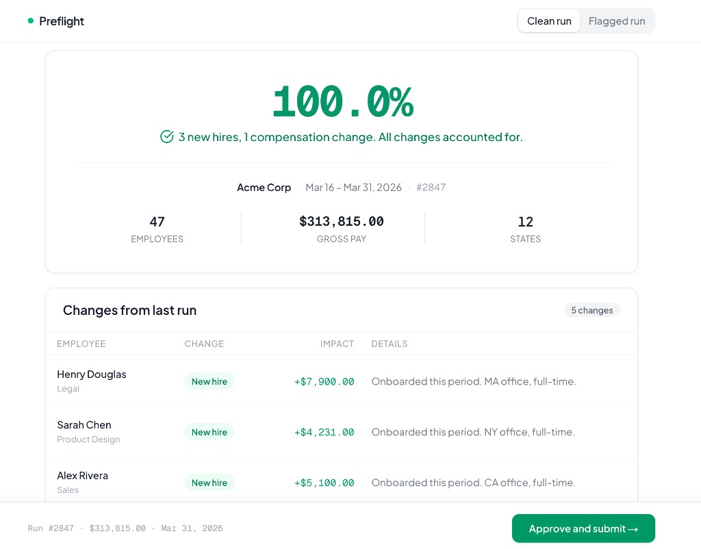
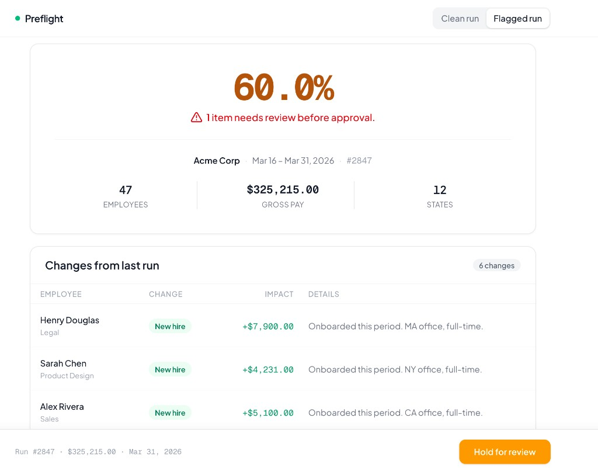

# Preflight

**Self-driving payroll needs collision detection. Preflight is that layer.**

Built as a product concept






---

## What is this?

Warp already lets founders run payroll on full Autopay. Taxes filed, payments sent, compliance handled. Self-driving employee management, for real.

But right now, whether a founder approves manually or Autopay handles it, nothing is verifying whether the numbers actually make sense before the money moves. If someone enters 400 hours instead of 40, the system processes it. Automatically. On schedule. Nobody catches it.

Preflight is the verification layer that sits underneath both workflows. It diffs each run against the previous one, flags anything unusual in plain English, and scores overall confidence. It doesn't add friction. It adds trust.

> Think of it this way: self-driving cars don't just drive. They have collision detection, lane monitoring, and anomaly alerts. Preflight is collision detection for self-driving payroll.

## How it works

Every payroll run passes through three checks before money moves:

```
Previous Run (45 employees, $298K)
        |
        v
+-----------------------------------+
|  1. Cross-run diff                |
|     Match employees by ID.        |
|     Classify every change:        |
|     new hire / term / raise /     |
|     unexplained                   |
+-----------------------------------+
|  2. Anomaly detection             |
|     Pay spike > 2x previous?      |
|     Hours > 80 in a period?       |
|     Flag it with severity.        |
+-----------------------------------+
|  3. Batch scorer                  |
|     Aggregate all findings.       |
|     Compute confidence score.     |
|     Recommend: pass or hold.      |
+-----------------------------------+
        |
        v
Current Run (47 employees, $313K)
Verdict: 100% confidence -- approve
```

**A concrete example.** In the "Flagged run" demo, an employee named James Liu shows $16,200 in gross pay. His previous period was $4,800. That's over 3x his normal amount, almost certainly someone entered 400 hours instead of 40. Preflight catches it, drops the confidence score to 60%, and holds the batch. That's a $12,000 mistake that never reaches the bank.

With Autopay on, that mistake would have processed automatically. With Preflight underneath, it doesn't.

### The three engine functions

Each one is a pure function. Input in, verdict out. No side effects.

**`lib/engine/diff.ts`** takes two `PayrollRun` objects and produces an array of `EmployeeDelta` items. It matches employees by ID across runs: present in current but not previous = new hire, present in previous but not current = termination, pay changed within 20% = raise, anything else = unexplained. Each delta gets a plain-English explanation generated from the data.

**`lib/engine/anomaly.ts`** scans the current run for statistical red flags. Two checks right now: pay spikes (gross pay more than 2x the previous period) and impossible hours (more than 80 in a single period for hourly employees). Both are common data entry errors that cost real money when undetected.

**`lib/engine/scorer.ts`** takes all deltas and findings and computes a single confidence score. Critical findings subtract 35 points, warnings subtract 10, unexplained deltas subtract 5. Score above 80 = pass. Below = hold. Also generates a summary string describing what it found.

## What's real and what's simulated

This is a product prototype built in 8 hours. Being upfront about the boundaries:

**Real (runs actual logic):**
- The diff engine computes all employee changes from raw payroll data
- The anomaly detector flags pay spikes and hour anomalies programmatically
- The scorer aggregates findings into a confidence score and pass/hold decision
- The toggle doesn't flip between two pre-baked views. It feeds different raw fixture data through the full analysis pipeline and the UI renders whatever comes out

**Simulated (would need real infrastructure):**
- Payroll data is fixture JSON, not a live Check API response
- No auth, no database, no audit trail persistence
- Plain-English explanations are template-generated, not LLM-generated
- Historical baselines use previous-run comparison, not a rolling statistical model

The frontend components (`BatchSummary`, `ChangesTable`, `FindingsCard`, `ApprovalBar`) read entirely from the `Verdict` object the engine produces. They don't contain business logic or hardcoded display values.

## How this scales in production

The prototype runs client-side. In production at Warp, the architecture shifts:

```
+----------------+     +--------------------+     +-----------------+
|  Check API     |---->|  Preflight         |---->|  Warp           |
|  (payroll      |     |  Service (TS)      |     |  Dashboard      |
|   engine)      |     |                    |     |                 |
|  Returns       |     |  * diff.ts         |     |  Shows verdict  |
|  calculated    |     |  * anomaly.ts      |     |  to founder     |
|  payroll run   |     |  * scorer.ts       |     |  OR              |
|                |     |  * history store   |     |  Auto-approves  |
+----------------+     +--------------------+     |  if score > 95  |
                              |                   +-----------------+
                              v
                       +--------------------+
                       |  Postgres           |
                       |  (Drizzle ORM)      |
                       |                    |
                       |  * Run history     |
                       |  * Audit trail     |
                       |  * Baselines       |
                       +--------------------+
```

**What changes at scale:**

- **Autopay integration.** Preflight runs as a gate before Autopay processes. Score above 95 = Autopay proceeds silently. Score between 80-95 = Autopay proceeds but founder gets a summary notification. Score below 80 = Autopay pauses, founder reviews manually. This makes Autopay smarter without making it slower.

- **History store.** Instead of comparing against one previous run, maintain a rolling window of 6-12 runs per employee. Anomaly detection shifts from simple ratio checks to z-score deviation against the historical mean. Catches slower-moving anomalies like gradual salary drift.

- **Audit trail.** Every verdict persisted with findings, who approved, and when. Drizzle ORM + Postgres, matching Warp's existing stack.

- **Webhook trigger.** Preflight runs automatically when Check posts a completed payroll calculation. No manual trigger. The founder only sees the dashboard when something needs attention.

- **Learning loop.** When a founder overrides a hold, that signal tunes scoring thresholds. Over time, Preflight calibrates to each company's payroll patterns.

## Stack

TypeScript, Next.js 14, Tailwind CSS, Vercel. All analysis runs client-side as pure functions. No external dependencies, no data leaves the browser.

## Try the demo

Toggle between "Clean run" and "Flagged run" in the top-right corner.

Clean mode: everything checks out. 3 new hires, 1 termination, 1 raise, all accounted for. 100% confidence. Green approve button.

Flagged mode: James Liu's gross pay spikes over 3x. Preflight catches it, explains it, and holds the batch. 60% confidence. Amber hold button. With Autopay on, this is the $12,000 mistake that gets stopped before it hits the bank.

---